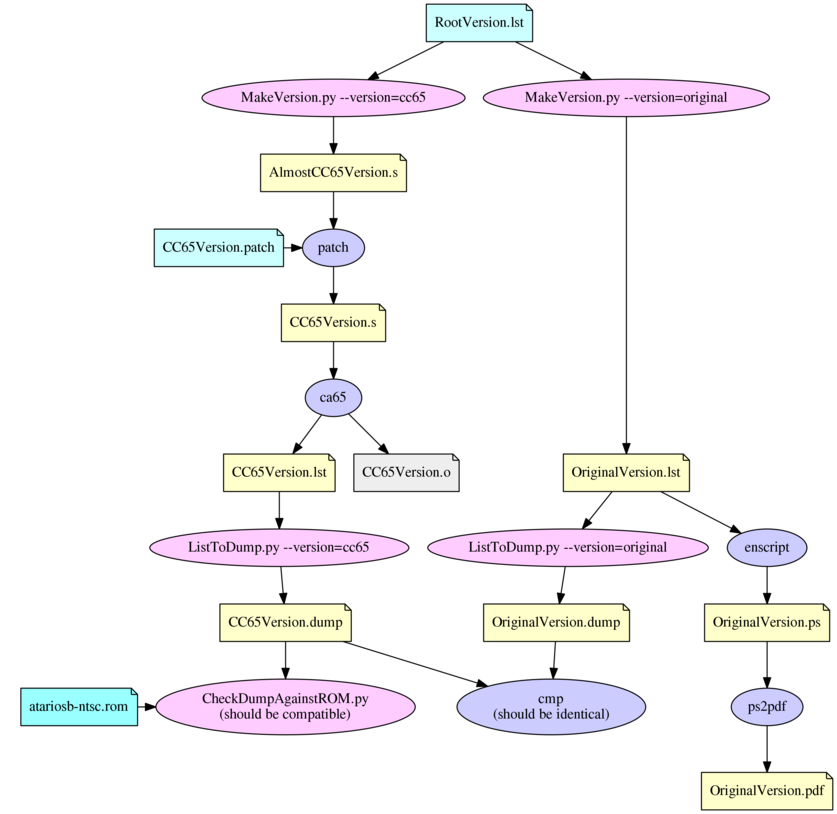

Atari 8-bit OSB NTSC ROM
========================

This repository contains the source code for the OSB NTSC ROM for the Atari 400 and 800 machines,
as obtained from scanning, OCRing, and proofreading a paper version of the Operating System Source
Listing as published by Atari.

Data Flow
---------

The data flow of processing the source file to the final products is shown below:

Description of files
--------------------

* atariosb-ntsc.rom

  This is the 10 Kb ROM image of the OSB ROMS. It consists of:

    - Floating Point routines   $D800 .. $DFFF   (2 kilobytes)
    - Character Set             $E000 .. $E3FF   (1 kilobyte)
    - Operating System          $E400 .. $FFFF   (7 kilobytes)

  The Operating System ROM listing covers the 7 KB of Operating System code.

* RootVersion.lst

  This is an annotated version of the Operating System Source List that has also been converted
  to lowercase.

  It contains two directives not found in the original Operating System Source List:

  \newfile -- indicates that the listing changes to a new file.
  \newpage -- indicates that the listing skips to a new page.

* MakeVersion.py

  This script reads the "RootVersion.lst" file (assumed to be available on stdin), and converts
  it to one of two representations, depending on the command line argument given:

  **MakeVersion.py --version=original**

  Convert the \newpage and \newfile directives to form feed (\f) characters, and convert
  everything to uppercase.

  The result is written to stdout. The Makefile redirects this to "OriginalVersion.lst", which
  should be identical to the paper version as listed in the Operating System Source Listing.

  **MakeVersion.py --version=cc65**

  Make the following changes:

  - The first 33 characters from each line are discarded;
  - Empty lines, the trailing "assembly errors" line, lines containing the \newfile and
    \newpage headers, and the per-page header lines are discarded;
  - The ".page" and ".title" directives are commented out;
  - The "*=" directive is replaced with a corresponding ".org" directive.

    The goal of these changes is to generate a version that is very close to something that can
    be assembled by the "ca65" assembler that is part of the "cc65" compiler suite.

    The result is written to stdout. The Makefile redirects this to "AlmostCC65Version.s".

    Note that this version can almost, but not quite, be assembled by the ca65 assembler.
    The required changes that remain are handled by providing a patch (see CC65Version.lst, below).

* CC65Version.patch

  This is a patch that, when applied to "AlmostCC65Version.s", produces "CC65Version.s", that can
  be assembled by the ca65 assembler.

  Changes include fixes for minor syntactic issues, and a change of the "boot?" symbol to "bootq".

* ListToDump.py

  TBD

* CheckDumpAgainstROM.py

  TBD

* DependencyGraph.dot

  TBD

* OperatingSystemSourceListing.tex

  TBD

Related work
------------

http://www.wudsn.com/productions/atari800/atariromchecker/help/AtariROMChecker.html

http://atariage.com/forums/topic/201133-os-source-code-all-revisions/#entry2667627
